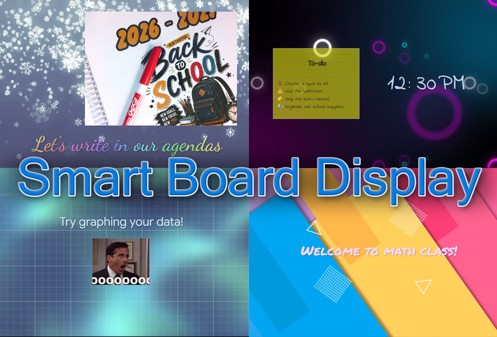

# Smart Board Display

A simple digital signage webapp intended for educational displays

## Purpose
Smart Board Display ("SBD") is a simple solution for a teacher wanting to display gifs, to-do lists, and videos on a smartboard, without the ugly user interface of Smart Notebook getting in the way.  SBD runs in your favorite browser and is designed to load outside resources as moveable "objects" that can be interacted with, on top of a video or image canvas.  SBD is designed to be infinitely expandable with Javascript and HTML; with just a little coding knowledge you can create any manner of resources, effects, interactives, etc.

## Quick-start guide
1. Double click on the file "Smart Board Display.html".  It will open in your default web browser.
2. Drag the tab containing SMB over to your smartboard so the window is visible.
3. Press F11 on your keyboard to go into full screen mode.
4. Right click anywhere on the smartboard to get going!
