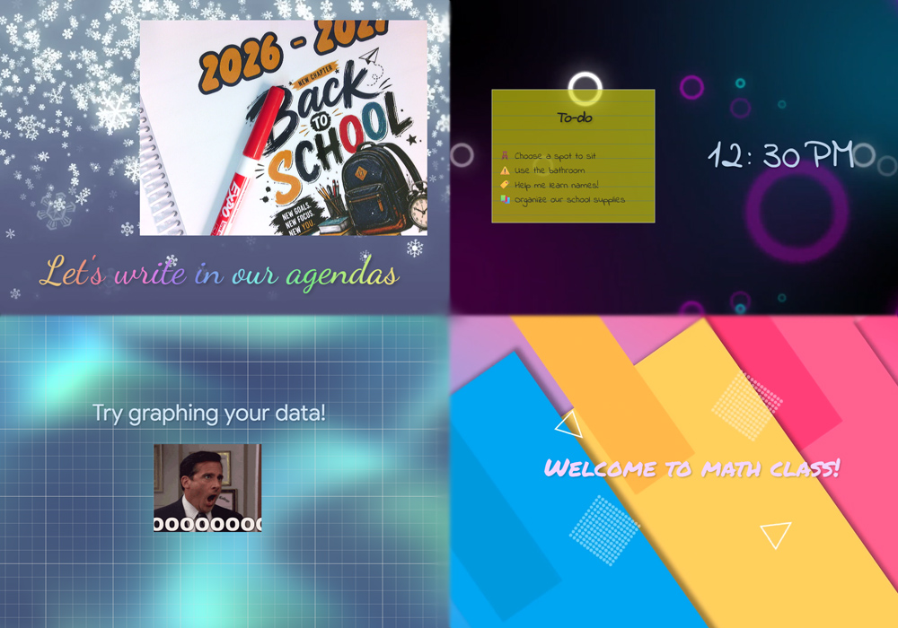
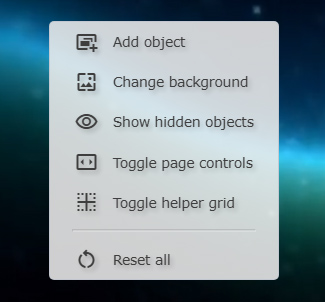
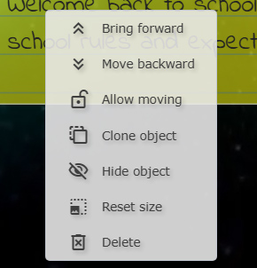

# Smart Board Display

A simple digital signage webapp intended for educational displays

## About
Smart Board Display ("SBD") is a simple solution for a teacher wanting to display gifs, to-do lists, and videos on a smartboard, without the ugly user interface of Smart Notebook getting in the way.  SBD runs in your favorite browser and is designed to load outside resources as moveable "objects" that can be interacted with, on top of a video or image canvas.  SBD is infinitely expandable -- with just a little coding knowledge you can create any manner of resources, effects, interactives, etc.

SBD is written in Javascript (jquery) and HTML.  It is simple, open-source, and designed to not make your school's IT department mad.

> [!IMPORTANT]
> This is proudly an AI-FREE product. No generative AI/large-language models were used in creating this software.  Please respect the humanity of its creators and do not use AI to modify SBD in any way.

## Quick-start guide
1. Double click on the file `Smart Board Display.html`.  It will open in your default web browser.
2. Drag the tab containing SMB over to your smartboard so the window is visible.
3. Press F11 on your keyboard to go into full screen mode.
4. Right click anywhere on the smartboard to get going!

## Adding objects
In the right-click menu, choose `Add object` to open the file picker.  Here you can add several different types of files.  Multiple file picking (by holding the shift/ctrl keys) is supported.
- Images and videos - most popular formats including animated and transparent types are supported.
- Text documents (.TXT) - text files are loaded as "notes" with a handwritten visual style.
- HTML files (.HTML) - these are loaded directly into the page.  With these you can build custom elements.  See the included Google Classroom and Slides buttons in the resources folder for examples.
- Scripts (.JS) - scripts allow you to modify the way the software behaves in a deep way.  Scripts can include custom elements, interactive tools, special effects, and more.

Once an object is added, it usually appears as a draggable item that can be placed around the app as you like.  See below for more info on the ways you can interact with objects and scripts added to the page.

## Changing the background
In the right-click menu, choose `Change background` to open the file picker.  Here you can change the background with two different options:
- Images and videos - the selected media is stretched over the whole background and plays in a loop if animated.
- Scripts (.MJS) - scripts can give greater control over various ways the background appears.

> [!NOTE]
> Script backgrounds may not play nicely with each other and can cause glitches if not used carefully.

> [!NOTE]
> There is no functional difference between the JS files loaded with the `Add object` option and the MJS files loaded with the `Change background` option - both are simple Javascript.  The file extension tells SBD whether the script is to be an object or a background.

## Interacting with objects

### Layering
Objects can stack in front of or behind each other.  Right-click on an object and use the `Bring forward` and `Move backward` buttons to adjust the order of objects in the stack.

### Positioning
You can prevent an object from moving by choosing the `Lock position` option.  `Allow moving` makes the object draggable again.

### Cloning
You can make a visual duplicate of an object by choosing `Clone object` in the right-click menu.

> [!NOTE]
> Cloned objects should be used for visuals only.  Associated scripts and actions may not work properly on a cloned object.

### Hiding
Right-click on an object and choose `Hide object` to make it disappear.  You can make it reappear at any point by choosing `Show hidden objects` in the main right-click menu.

### Resizing
Hover your mouse over an item and scroll the wheel to change its size.  You can right-click on the object and choose `Reset size` to set it back to normal.

### Deleting
Surprisingly, the `Delete` option in the right-click menu lets you delete an object.

### More actions
Many objects will have additional features and right-click options.
- images and videos allow you to add a hyperlink in their right-click menu.  Use this to set a link that can be opened by double-clicking on the item.
- scripts such as `fancy text.js` will let you edit the text content through the right-click menu.

## Page controls

SBD supports arranging objects into basic pages.  Right-click anywhere on the background and choose `Toggle page controls` to show the page control buttons.  Switching pages will slide all objects according to their placement in the page order.  The background of SBD will remain unchanged.

> [!NOTE]
> Revealing hidden objects will only apply to objects on the current page.  Hidden objects on pages that are not visible will be unaffected.

## Helper grid

SBD has a simple grid to divide the screen into thirds and sixths, for easier placement.  Right-click anywhere on the background and choose `Toggle helper grid` to reveal.

## Included resources

Some helpful tools in the `resources` folder include:

- `add search options.js` - adds four easy search tools to your right click menu, including Youtube and Maps.
- `button - [..].html` - two sample buttons.  Open in any text editor to change them to go directly to your Classroom, slideshow, etc.
- `clock - digital.js` - a digital clock with some color/font formatting options.
- `fancy text.js` - formattable large text.  Has an animated rainbow option.
- `graph paper.js` - adjustable grid lines for your smartboard.
- `todo list.js` - a customizable to-do list.  Right-click or click underneath to add a new item.  Click on any time to check it off.  Drag items by the handles to reorder.
- `wallpaper - colors.mjs` - build your own color gradients for your background.  Allows blending with images/videos underneath.
- `web cam.js` - display the video from an attached camera.

Check the "goodies" release zip for even more things to add to your resources.
